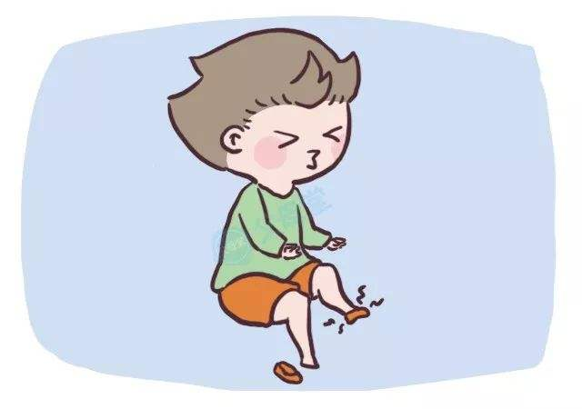

# 一些想法
---

---
### 鞋子不合脚怎么办？
---
办法一：换双合脚的鞋子
---
### 换鞋子的长处：

1. 效率高
2. 内耗小（受伤小）
2. 整体性强
---
### 换鞋子的短处：

1. 不容易找到合适的
2. 需要一个横向的核心推动团队
2. 意外损失可能更大
2. 整体性强
---
办法二：磨!
---
### 磨的好处

1. 群众智慧
2. 不存在大的损失
---
关于可审计性